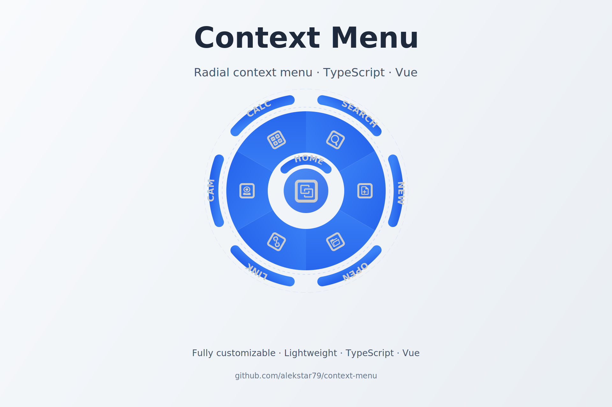

# Context Menu TS (Vanilla/Vue3)

[](https://www.npmjs.com/package/@alekstar79/context-menu)
[](LICENSE)
[](https://github.com/alekstar79/context-menu)
[](https://www.typescriptlang.org)
[](https://github.com/alekstar79/comparison-slider)

> A beautiful and customizable radial context menu written in TypeScript.
> It can be used both as a plain JavaScript/TypeScript module and as a Vue component.
> The project includes full TypeScript support (types are exported) and provides a simple API for controlling the menu (show/hide, event subscription).
> The library is lightweight, has no required dependencies (Vue 3 is optional), and can be easily integrated into existing projects.



**[View Live Demo](https://alekstar79.github.io/context-menu)**

<!-- TOC -->
* [Context Menu TS (Vanilla/Vue3)](#context-menu-ts-vanillavue3)
  * [✨ Features](#-features)
  * [📦 Installation](#-installation)
  * [🚀 Usage](#-usage)
  * [⚙️ Configuration](#-configuration)
  * [🧠 API](#-api)
    * [Methods](#methods)
    * [Events](#events)
    * [Vue component CircularMenu](#vue-component-circularmenu)
  * [💅 Styling](#-styling)
  * [🛠️ Development](#-development)
    * [Scripts](#scripts)
  * [📄 License](#-license)
<!-- TOC -->

## ✨ Features

    🎨 Customizable appearance (colors, radii, opacity)
    🖼️ SVG icon support via sprites
    💬 Hints with optional background
    🖱️ Hover and wheel animations
    🧩 Optional central button
    📦 Two usage modes: vanilla JS and Vue 3 component
    ⚡ Full TypeScript support (types included)

## 📦 Installation

```bash
npm install context-menu
```

The library has an optional peer dependency on vue. If you are using the Vue component, install Vue 3 as well:

```bash
npm install vue@^3
```

## 🚀 Usage
1. Vanilla JS / TypeScript

```ts
import { defineConfig, Manager } from 'context-menu-ts'

const config = defineConfig({
  sprite: '/path/to/icons.svg',  // path to SVG sprite
  innerRadius: 50,
  outerRadius: 150,
  opacity: 0.7,
  color: '#1976D2',
  sectors: [
    { icon: 'new', hint: 'New' },
    { icon: 'open', hint: 'Open' },
    { icon: 'save', hint: 'Save' }
  ],
  centralButton: {
    icon: 'home',
    hint: 'Home',
    hintPosition: 'top'
  }
})

// container element where the menu will be placed
const container = document.getElementById('menu-container')
const menu = new Manager(container, config)

// subscribe to events
menu.on('click', (data) => {
  console.log(`Selected: ${data.hint}`)
})

// show menu at cursor position (e.g., on contextmenu)
window.addEventListener('contextmenu', (e) => {
  e.preventDefault()
  menu.show(e)
})
```

2. Vue Component

```vue
<template>
  <CircularMenu
    ref="menuRef"
    :sprite="sprite"
    :inner-radius="75"
    :outer-radius="150"
    :sectors="sectors"
    :central-button="centralButton"
    color="#42B883"
    @click="onMenuItemClick"
  />
</template>

<script setup lang="ts">
import { ref } from 'vue'
import ContextMenu from 'context-menu/vue'
import type { ISector } from 'context-menu'

const sprite = '/icons.svg'
const sectors: ISector[] = [
  { icon: 'new', hint: 'New' },
  { icon: 'open', hint: 'Open' },
  { icon: 'save', hint: 'Save' }
];

const centralButton = {
  icon: 'home',
  hint: 'Home',
  hintPosition: 'bottom'
}

const menuRef = ref()

const onMenuItemClick = (data: { icon: string; hint: string }) => {
  console.log('Selected:', data.hint)
}

// Example of manually showing the menu
const showMenu = (e: PointerEvent) => {
  menuRef.value?.show(e)
}
</script>
```

## ⚙️ Configuration
`defineConfig(options: Partial<IConfig>): IConfig`

Creates a configuration object with default values.

`IConfig` interface

| Property            | Type           | Default        | Description                                                                                  |
|---------------------|----------------|----------------|----------------------------------------------------------------------------------------------|
| sprite              | string         | `../icons.svg` | Path to the SVG sprite containing icons                                                      |
| innerRadius         | number         | –              | Inner radius of sectors (the smaller ring radius)                                            |
| outerRadius         | number         | –              | Outer radius of sectors                                                                      |
| opacity             | number         | `0.7`          | Opacity of sectors and hint backgrounds (if any)                                             |
| color               | string         | –              | Main color for sectors and hint backgrounds (default '#1976D2' if omitted)                   |
| hintPadding         | number         | –              | Padding around the hint text (pixels). If not set, the hint is rendered without a background |
| iconScale           | number         | –              | Global scale factor for all icons (can be overridden per sector)                             |
| iconRadius          | number         | –              | Global radius at which icons are placed (can be overridden per sector)                       |
| sectors             | ISector[]      | `[]`           | Array of menu sectors                                                                        |
| centralButton       | ICentralButton | –              | Configuration for the central button                                                         |
| autoBindContextMenu | boolean        | `true`         | Automatically bind the contextmenu event listener to window                                  |


`ISector` interface

| Property    | Type       | Default | Description                               |
|-------------|------------|---------|-------------------------------------------|
| icon        | string     | –       | Icon identifier (without #)               |
| hint        | string     | –       | Hint text                                 |
| onclick     | () => void | –       | Click handler for the sector              |
| rotate      | number     | `0`     | Additional rotation of the icon (degrees) |
| iconScale   | number     | global  | Icon scale for this specific sector       |
| iconRadius  | number     | global  | Icon placement radius for this sector     |
| hintPadding | number     | global  | Hint padding for this sector              |


`ICentralButton` interface

| Property       | Type             | Default | Description                                                     |
|----------------|------------------|---------|-----------------------------------------------------------------|
| icon           | string           | –       | Icon identifier                                                 |
| hint           | string           | –       | Hint text                                                       |
| onclick        | () => void       | –       | Click handler                                                   |
| iconScale      | number           | global  | Icon scale                                                      |
| iconRadius     | number           | global  | Icon radius (effectively the button size)                       |
| hintPosition   | `top \|  bottom` | `top`   | Position of the hint relative to the button                     |
| hintSpan       | number           | `180`   | Angular span of the hint arc (degrees)                          |
| hintDistance   | number           | `8`     | Distance from button edge to the hint text (when no background) |
| hintOffset     | number           | –       | Absolute offset of the hint (overrides hintDistance)            |
| hintPadding    | number           | global  | Hint padding for the central button                             |
| hintStartAngle | number           | –       | Start angle of the arc (must be set together with hintEndAngle) |
| hintEndAngle   | number           | –       | End angle of the arc                                            |


## 🧠 API

`Manager` class (vanilla)

```ts
const menu = new Manager(container: HTMLElement, config: IConfig)
```

### Methods

- `show(event: MouseEvent | PointerEvent)` – Shows the menu at the cursor position.
- `hide()` – Hides the menu.
- `on(event: string, callback: Function)` – Subscribes to events.

### Events

- `click` – Emitted when a sector or the central button is clicked. The callback receives `{ icon: string; hint: string }`.

### Vue component CircularMenu

**Props**

All properties from `IConfig` except `sectors` and `centralButton` (they are passed separately).  
Additional props:

- `autoBindContextMenu` – Automatically bind contextmenu to window (default `true`).

**Events**

- `click` – Same as the vanilla `click` event.

**Exposed methods (via `ref`)**

- `show(event: PointerEvent)` – Shows the menu.
- `hide()` – Hides the menu.

## 💅 Styling

> The library comes with basic styles that are automatically included. You can override them using the following CSS classes:

- `.context` – Root menu container.
- `.radial-menu-svg` – The SVG element.
- `.radial-sector` – A sector.
- `.radial-icon` – An icon.
- `.radial-hint` – Hint text.
- `.radial-hint-bg` – Hint background.
- `.central-sector`, `.central-icon`, `.central-hint` – Central button elements.
- `.active` – Class added to hints on hover.

Example of customization:

```scss
.radial-hint {
  font-size: 14px;
  font-weight: 600;
  fill: #000;
}
```

## 🛠️ Development

```bash
git clone <repo>
cd context-menu
npm install
```

### Scripts

- `npm run dev` – Start dev server with demo.
- `npm run build` – Build the library.
- `npm run build:demo` – Build the demo app.
- `npm run test` – Run tests.
- `npm run test:ui` – Run tests with UI.
- `npm run test:coverage` – Run tests with coverage.

Project structure:

- `src/` – Source code.
- `src/menu/` – Core menu implementation.
- `src/components/` – Vue component.
- `src/core/` – Utilities and SVG wrapper.
- `public/` – Static assets for the demo.

## 📄 License

MIT © [alekstar79](https://github.com/alekstar79)

For more examples and a live demo, visit the repository. Feel free to open issues for questions or suggestions.
